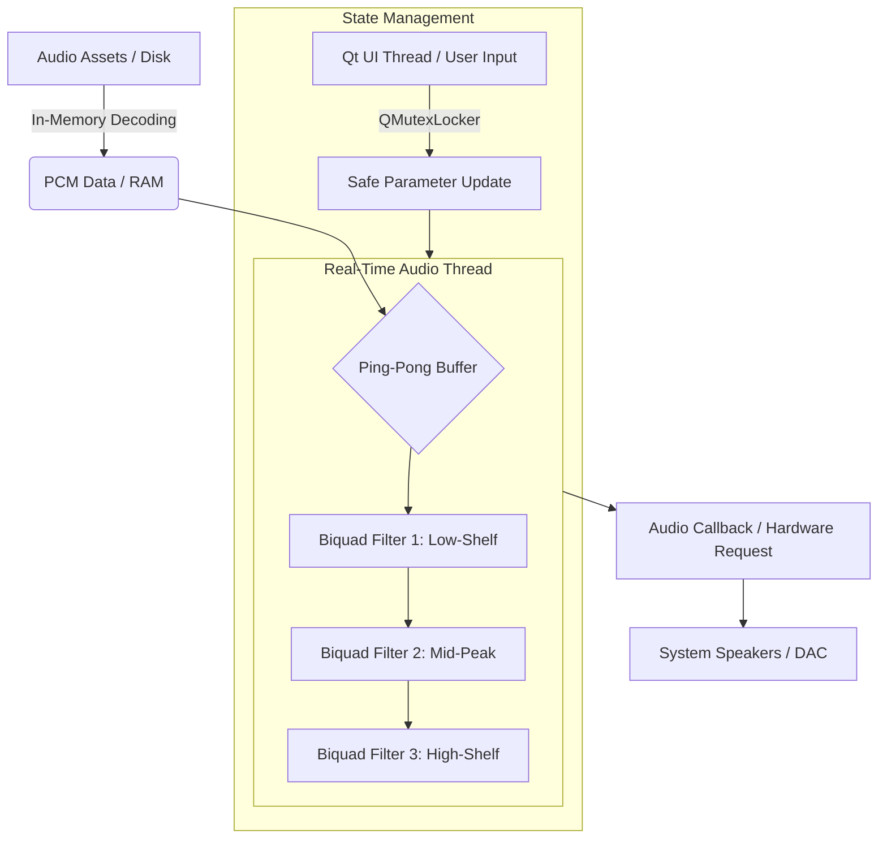

# Sonus Flow
**High-Performance Auditory Training Infrastructure for APD**

[](#medical-disclaimer)
[](https://isocpp.org/)
[](https://www.qt.io/)

---

## ⚠️ Medical Disclaimer
Sonus Flow is a **technical prototype** and is currently in a Pre-Alpha state. It has not been clinically validated and is not intended for use as a diagnostic or therapeutic tool for Auditory Processing Disorder (APD). **Always consult with a qualified Audiologist or medical professional before beginning any auditory training regimen.**

---

## System Vision
Auditory Processing Disorder (APD) is a neurological condition where the brain struggles to interpret sound, particularly in "Cocktail Party" environments where the signal-to-noise ratio is low. 

**Sonus Flow** is an engineered solution designed to facilitate auditory discrimination training via controlled, simulated environments. By leveraging **neuroplasticity**, the application provides a modular platform for practicing voice isolation amidst complex background soundscapes.

## Engineering Highlights

* **Pull-Based Audio Architecture:** Utilizes a low-latency, pull-based callback system via the **MiniAudio** engine to ensure zero-jitter playback.
* **Multithreaded State Management:** Implements strict decoupling between the **Qt 6 UI thread** and the **High-Priority Audio thread** using mutex-guarded state updates, preventing GUI events from blocking real-time DSP.
* **Subtractive-Only DSP Chain:** Features a professional-grade 3-band biquad equalizer (low-shelf, peaking, high-shelf) designed with a **subtractive-only constraint** to promote vocal clarity while protecting user hearing.
* **Dynamic Asset Discovery:** Implements a directory-crawling logic for automatic ingestion of PCM assets, allowing for extensible training libraries without code recompilation.

## High-Performance Audio Architecture
The application is designed around **Data Decoupling** and hardware-dictated timing to ensure professional-grade reliability.

* **Zero-Jitter Playback:** Hardware "pulls" data from a dedicated high-priority buffer thread, eliminating stutters associated with CPU-bound "push" models.
* **Thread Safety:** The DSP engine resides in a real-time thread, ensuring the audio "flow" remains uninterrupted even during heavy GUI resource utilization.
* **Buffer Integrity:** Minimizes underflow and digital clipping risk, critical for sensitive therapeutic applications.

## Technical Architecture
Sonus Flow is designed around the principle of **Data Decoupling**. By separating the UI, the File System, and the DSP Engine into distinct layers, the application ensures that the high-priority audio callback is never blocked by disk I/O or GUI events. 

The following diagram illustrates the signal path and thread boundaries:


    
---

## 🚀 Future Roadmap
To move Sonus Flow from a prototype to a clinically viable tool, the following technical milestones are planned:

* **Integrated Peak Limiting & LUFS Metering:** Implementing an ITU-R BS.1770-4 compliant loudness metering system and a transparent look-ahead limiter to ensure all training assets adhere to safe output standards.
* **Neural Voice Isolation (AI Integration):** Integrating lightweight machine learning models (e.g., via ONNX Runtime) to provide real-time voice-from-noise isolation, allowing for advanced "noise-masking" difficulty levels.
* **Spatial Audio Implementation (HRTF):** Moving from stereo to binaural spatialization using Head-Related Transfer Functions. This will allow users to practice "spatial release from masking," a critical skill in overcoming APD.
* **Session Telemetry & Progress Tracking:** Development of a local, encrypted SQLite database to track user performance metrics over time, providing data-driven feedback for clinicians.

---

## Getting Started (Building from Source)

This guide assumes a Linux environment. You will need a C++ compiler, CMake, and the Qt 6 development libraries.

### Prerequisites

* **On Arch Linux:**
    ```sh
    sudo pacman -S base-devel cmake qt6-base alsa-lib
    ```
* **On Ubuntu/Debian:**
    ```sh
    sudo apt-get install build-essential cmake qt6-base-dev
    ```

### Build Steps

1. **Clone the repository:**
    ```sh
    git clone [https://github.com/KYNNAC/SonusFlow.git](https://github.com/KYNNAC/SonusFlow.git)
    cd SonusFlow
    ```
2. **Create a build directory:**
    ```sh
    mkdir build && cd build
    ```
3. **Run CMake to configure the project:**
    ```sh
    cmake ..
    ```
4. **Compile the project:**
    ```sh
    make
    ```
5. **Run the application:**
    The application requires its `sounds` asset folder to be in the same directory as the executable. 
    ```sh
    ./SonusFlow
    ```

---
