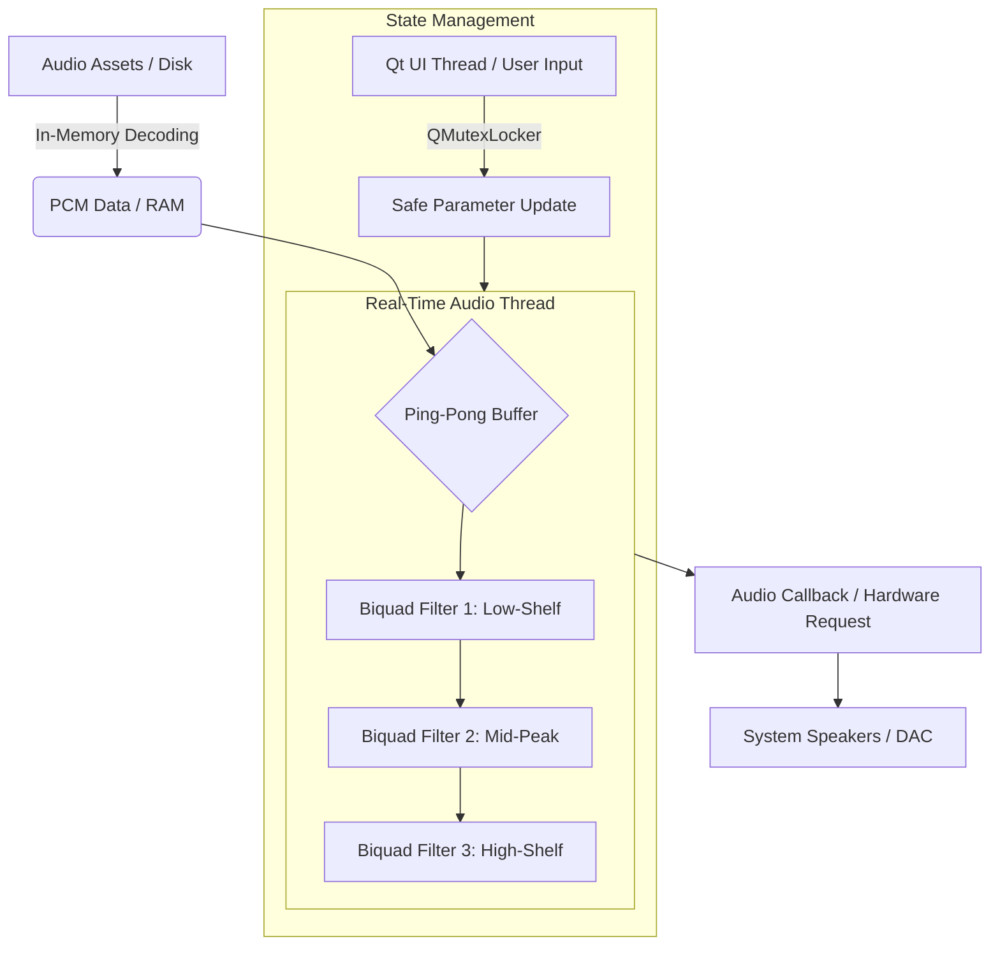

# Sonus Flow

#### Video Demo
**https://www.youtube.com/watch?v=N-_ukKYBgmg**

## Description:
*An Auditory Training Tool for Auditory Processing Disorder (APD)*

---


⚠️ **MEDICAL DISCLAIMER & PROJECT STATUS**

Sonus Flow is currently in a Pre-Alpha state. This software is a prototype. It has not been clinically validated, and it is not yet intended for use as a diagnostic or therapeutic tool for Auditory Processing Disorder (APD).

**Use of this software is at your own risk. Always consult with a qualified Audiologist or medical professional before beginning any auditory training regimen or treatment.**

---

## The Challenge: Understanding APD

Auditory Processing Disorder (APD) is a neurological condition that affects how the brain processes sound. Individuals with APD can hear perfectly well, but their brains struggle to interpret and make sense of what they hear, especially in complex auditory environments. This can make everyday situations, like holding a conversation in a bustling cafe or focusing on a lecture, incredibly challenging.

This difficulty in filtering out background noise to focus on a primary sound source is often related to the "cocktail party effect," a cognitive skill that many of us take for granted. For those with APD, the brain doesn't easily separate the "signal" from the "noise."

---

## The Solution: Sonus Flow

**Sonus Flow** is a non-commercial, therapeutic tool designed to help individuals with APD practice and improve their auditory discrimination skills in a controlled, safe environment.

By simulating real-world scenarios, the application provides targeted exercises that aim to leverage the principles of neuroplasticity—the brain's ability to reorganize itself by forming new neural connections. The goal is to help the user's brain become more efficient at identifying and focusing on a target voice amidst a backdrop of ambient sound, with the hope that this practice translates to improved focus in daily life.

---

## Core Features

* **Simulated Real-World Environments:** Choose from a library of background soundscapes to replicate challenging listening situations.
* **Targeted Voice Training:** Isolate and focus on a specific vocal track, training your brain to "lock on" to a single speaker.
* **Independent Playback Control:** Manage the voice and background channels separately to customize the difficulty of your training session.
* **Focus-Targeting EQ:** Utilize a professional-grade 3-band subtractive equalizer to gently "carve out" space for the voice, making it more intelligible without artificially boosting volume.
* **Extensible by Design:** The application automatically discovers and loads new voice and background files placed in the `sounds` directory, allowing for an ever-growing library of training scenarios.

---

## High-Performance Audio Architecture

Sonus Flow utilizes a **pull-based audio callback system** via the MiniAudio engine. This architecture is a deliberate design choice to ensure professional-grade reliability:

* **Zero-Jitter Playback:** Instead of the application "pushing" audio data to the sound card (which can cause stutters if the CPU is busy), the audio hardware "pulls" data directly from a dedicated high-priority buffer thread.
* **Thread Safety:** This separates the User Interface (Qt thread) from the Audio Processing (Callback thread). Even if the GUI is being resized or is heavy on resources, the audio "flow" remains uninterrupted, preventing listener fatigue.
* **Buffer Integrity:** By allowing the hardware to dictate the pace, Sonus Flow significantly reduces the risk of underflows or digital clipping, which is vital for a sensitive therapeutic application.

---

## Safety by Design

Hearing health is paramount. Sonus Flow is built from the ground up to be a protective tool, not a harmful one.

### 1. Subtractive-Only EQ
Unlike traditional equalizers that can boost frequencies to potentially dangerous levels, the EQs in Sonus Flow are **subtractive-only**. The controls can only reduce the volume of specific frequency bands. This is a common technique in professional audio that promotes clarity and prevents excessive loudness, ensuring a safe and comfortable listening experience.

### 2. Safe Mode (Planned Feature)
A planned "Safe Mode" will provide an optional master volume limiter. When enabled, it will ensure the total output of the application never exceeds a comfortable, standardized listening level (e.g., -14 LUFS), providing peace of mind during longer training sessions.

---

## Technical Implementation

* **Languages:** C++17
* **Framework:** Qt 6 (for the cross-platform GUI)
* **Build System:** CMake
* **Audio Engine:** The core audio playback and processing is powered by the lightweight **MiniAudio** library. The 3-band equalizer is a chain of biquad filters (*low-shelf, peaking, high-shelf*) designed to provide broad, musical control over the vocal frequency range.

## Design Decisions

* **Why MiniAudio?** Chosen for its "header-only" nature and C-based efficiency. This ensures low-latency playback which is critical for auditory training where any digital lag could cause listener fatigue.
* **Why Subtractive EQ?** In APD therapy, the goal is to train the brain to find the "signal" from the "noise". By using a subtractive-only model, Sonus Flow ensures that the user is practicing clarity rather than simply turning up the volume, which projects the user's hearing over long-term use.
* **File Discovery Logic:** Instead of hardcoding a playlist, Sonus Flow features an automatic directory crawler. This empowers clinicians or audiologists to drop their own specific "trigger" sounds or "target" voices into the app without recompiling.

---

## System Architecture

Sonus Flow is designed around the principle of **Data Decoupling**. By separating the UI, the File System, and the DSP Engine into distinct layers, the application ensures that the high-priority audio callback is never blocked by disk I/O or GUI events. 

The following diagram illustrates the signal path and thread boundaries:


    
---

## 🚀 Future Roadmap
To move Sonus Flow from a prototype to a clinically viable tool, the following technical milestones are planned:

* **Integrated Peak Limiting & LUFS Metering:** Implementing an ITU-R BS.1770-4 compliant loudness metering system and a transparent look-ahead limiter to ensure all training assets adhere to safe output standards.
* **Neural Voice Isolation (AI Integration):** Integrating lightweight machine learning models (e.g., via ONNX Runtime) to provide real-time voice-from-noise isolation, allowing for advanced "noise-masking" difficulty levels.
* **Spatial Audio Implementation (HRTF):** Moving from stereo to binaural spatialization using Head-Related Transfer Functions. This will allow users to practice "spatial release from masking," a critical skill in overcoming APD.
* **Session Telemetry & Progress Tracking:** Development of a local, encrypted SQLite database to track user performance metrics over time, providing data-driven feedback for clinicians.

---

## Getting Started (Building from Source)

This guide assumes a Linux environment. You will need a C++ compiler, CMake, and the Qt 6 development libraries.

### Prerequisites

* **On Arch Linux:**
    ```sh
    sudo pacman -S base-devel cmake qt6-base alsa-lib
    ```
* **On Ubuntu/Debian:**
    ```sh
    sudo apt-get install build-essential cmake qt6-base-dev
    ```

### Build Steps

1.  **Clone the repository:**
    ```sh
    git clone [https://github.com/KYNNAC/SonusFlow.git](https://github.com/KYNNAC/SonusFlow.git)
    cd SonusFlow
    ```
2.  **Create a build directory:**
    ```sh
    mkdir build && cd build
    ```
3.  **Run CMake to configure the project:**
    ```sh
    cmake ..
    ```
4.  **Compile the project:**
    ```sh
    make
    ```
5.  **Run the application:**
    The application requires its `sounds` asset folder to be in the same directory as the executable. The CMake configuration handles this automatically.
    ```sh
    ./SonusFlow
    ```

--- 

### 📝 Development Note & Academic Honesty
Concept and initial GUI scaffolding for **Sonus Flow** began in June 2025. Core engine integration, DSP logic, and thread-safe state management were developed concurrently with my enrollment in **CS50x** (starting July/August 2025). This timeline allowed me to directly apply course concepts—specifically memory safety, multithreading, and modular system architecture—to the project's evolution.

---
